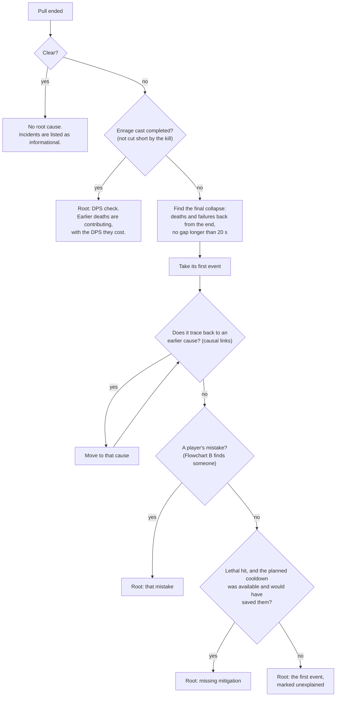
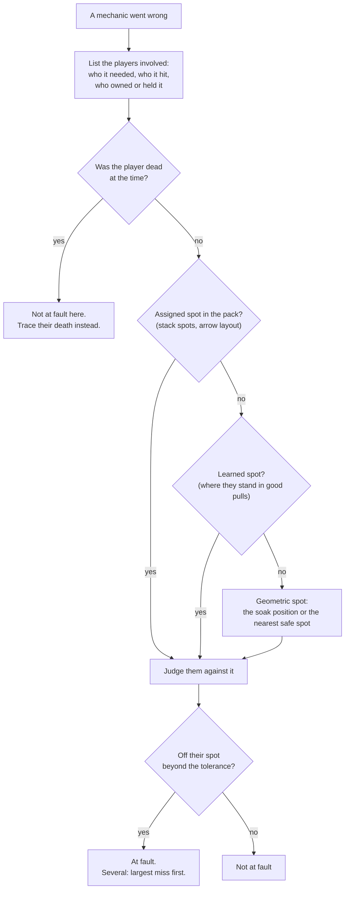

# Who gets the blame: root-cause attribution

After every wipe the after-action report answers two questions:

1. **Which incident is the root cause?** Flowchart A answers it.
2. **Who is at fault for it?** Flowchart B answers it.

This page is the rulebook for both. Encounter packs and the analyzer follow it. When the code disagrees with this page, the code is wrong: see [Where the analyzer differs today](#where-the-analyzer-differs-today).

## Principles

- **Whoever was out of position is at fault**, not whoever set off the consequence. Positions are judged against the group's fixed spots: the waymark-relative spots in the encounter pack, then where each player stands in good pulls. Geometry is the last resort.
- **The root cause is the earliest mistake the wipe traces back to.** Follow the chain backwards from the collapse, for example: death ← vulnerability ← clipped by a spread ← spreader off their spot. The root can be a mistake that killed nobody by itself. When several separate mistakes would each have wiped the pull, the earliest one is the root and the others are contributing.
- **A cause comes before its effect.** Something that happens at the same moment as an event (within 0.3 s) is part of it, not what caused it.
- **Consequences are not mistakes.** The following are never at fault for what happened to them:
  - players who died to someone else's mistake;
  - absorbers who took a short stack;
  - a Confused player who reached an ally;
  - a player who reset Damage Down on purpose;
  - players who kill themselves to end a lost pull, e.g. after a missed tower gives the whole party Damage Down. These are "wiped on purpose", not resets, and are no part of the collapse.
- **A mistake the wipe doesn't trace back to is informational.** That covers non-lethal errors and ones the party recovered from. They are listed in the report but never become the root.

## Flowchart A: which incident is the root

### Causal links

These are the "traces back to" steps in Flowchart A. Each one moves from an effect to the event that caused it.

| Effect | Traces back to |
|---|---|
| A hit made lethal by a vulnerability debuff | The hit that applied the vulnerability. |
| An absorber or soaker dies in a stack, absorb or tower that was short | Whoever was out of place for it: the holder, or the players missing from it. If too few of the group were alive to fill it, the deaths that left it short. |
| A Confused player kills an ally | The broken arrow chain, then the arrow at fault, then whoever placed it or knocked someone into it. |
| A hit that is harder for each misplaced arrow (`misplacedPenalty`, e.g. Indulgent Will) kills a player by itself | The arrows on the ground off their spots when it hit, then whoever placed them. |
| A Damage Down reset (a deliberate death) | Whatever applied the Damage Down: a missed tower, an avoidable hit (even one a shield absorbed, if it left the debuff). "Too many resets overwhelmed recovery" is a contributing note, never the root or the verdict. A deliberate death by someone not raised before the end, after most of the party (5+) got the same Damage Down, is a deliberate wipe, not a reset. |
| A party-wide failure | What set it off: the rock that touched the puddles, the second cleanse inside the vulnerability window, the bomb holder who moved. |
| Fell off the arena | The knockback, then whoever was off their spot for it. |
| A death to another player's targeted AoE (tether rock, bait line, spread, laser) | The rule for [player-targeted AoEs](#rules-per-mechanic). |
| A job nobody did because its player was already dead, e.g. a tower whose soakers had died | Those deaths, and from them, whatever caused each one. A bystander is never blamed for the gap. |

## Flowchart B: who is at fault

If nobody involved was off their spot, nobody is blamed. The incident is informational, or "unexplained" if it is the root.

**Where spots come from:**
- **Assigned spots:** the encounter pack, for example:
  - `positions` on an ability (the confetti holder and soaker corners);
  - the `arrowPuzzle` layout;
  - `soakGroup: "role"` on a tower that drops on a player: the role-mates who weren't targeted soak it;
  - `soakOrder` on towers two groups soak in a fixed rotation, e.g. P2 Forsaken towers `AAABBBBA`. Group A is the first players marked with a stack (Spell's Trouble) plus their melee/ranged partners (MT+H1, OT+H2, M1+R1, M2+R2); group B is everyone else. Who actually soaked each set is in the log: the tower hits, and the new Spell's Trouble icons that soakers get half a second later.
  - `baitAt: "maxMelee"` on a bait the strategy takes with everyone at max melee of the boss (hitbox + 3 y), e.g. Past's/Future's End.
- **Learned spots:** the position profile built from your good pulls (`rr learn`, or the plugin as you play). A learned spot counts only when the player stood in a consistent place in at least 3 good pulls. "Off their spot" means more than 2.5 y away, or more than 2.5 times their usual spread if that is larger.
- **Geometric spots:** the soak position or the nearest safe spot. A player standing with a group (at least two others within 3.5 y) counts as on their spot, because a group is a stack spot. This is what decides cases with no consistent learned spot, such as tether rocks, whose spots depend on who gets which tether.

## Rules per mechanic

| Mechanic | At fault | Not at fault |
|---|---|---|
| **Player-targeted AoE** (tether rock, bait line, spread, laser) hits another player | The AoE's owner, if they were out of position. Otherwise the player hit, if they were out of position. If both were near their spots, it still only hits someone else when somebody was out of place, so whichever was farther off (at least 2 y) is at fault. A player standing with a group counts as on their spot, so an AoE carried into a group is its owner's fault. Players hit together by design (a stack or absorb) are judged as one: see the next row. The verdict is "Out of position". If positions don't decide it and the bait is taken at max melee (`baitAt`), whichever of the two was farther from the max-melee ring baited it incorrectly; the verdict is "Incorrect baiting". | The player hit, when the owner carried it to them. |
| **Cone fired at the player nearest its holder** (`aim: "nearestToHolder"`, e.g. Spell's Trouble cones) goes to the wrong player | The holder, who aims it by where they stand, when it went to a player who was taking their own spread, stack or bait at that moment. The report gives who was nearest and who was next; a few tenths of a yalm can decide it. A player caught on the cone's way to the player it went to is judged as above, against that player. | The player it went to, when they were on their spot. |
| **Role stack** (`soakGroup: "role"`, e.g. the confetti) short of players | The holder or the role-mates who stayed out, whichever was off their spot (assigned, then learned); both if both were, largest miss first. If neither was, whichever was farther off (at least 2 y). With only one side's spot known and that side on it, the other side. With no spots, the holder when everyone who stayed out stood with the players who took it; otherwise those standing apart. A role-mate inside the other group's stack instead is out of place, unless they were on their own spot. | The players who took it, even if they died. Role-mates already dead: trace their deaths. A player on their spot whom another group's stack was brought to. |
| **Other stack, absorb or tower** short of players | The players missing from it, judged against assigned then learned spots. If the rest of the group stood together and the holder was elsewhere, the holder. | Absorbers who took it, even if they died. |
| **Tower in a soak rotation** (e.g. P2 Forsaken towers, `AAABBBBA`) short of players | The set's group members who weren't in any of its towers. If none were absent, the member who doubled up in the set's other tower instead. | Players of the other group, who weren't meant to soak that set. Group members already dead: trace their deaths. |
| **Tower dropped on a player** (e.g. Wave Cannon) left empty | The dropper's role-mates who weren't targeted and didn't take it. A role-mate who doubled up in another tower was free to take this one. | The players it dropped on. Role-mates already dead: trace their deaths. |
| **Inside two stacks at once** | The players off their spot. If everyone was on their spot, the holders whose stacks were placed too close. | — |
| **Soak set off early** (e.g. a puddle) | The first player in, unless a knockback put them there. In that case, whoever was off their spot for the knockback. | A player pushed in from their spot. |
| **Hazard contact** (e.g. a rock touching a puddle) | The trigger's holder, only if their trigger was within contact range. Otherwise unexplained. | The holder whose trigger was merely the closest, but not in range. |
| **Proximity bait** (jumps to the farthest or closest player) | The intended baiter (assigned, then learned) if someone else ended up baiting. Otherwise whoever was out of position. | Players who took the landing. |
| **Arrow puzzle** | Misplaced arrow → whoever dropped it. Arrows dropped on each other → the dropper(s) off their spot. Arrow used before the confusion → whoever was off their spot for the knockback that caused it, otherwise whoever dropped the arrow. A death to Indulgent Will, which hits harder for each arrow left on the ground off its spot, when that hit alone was lethal → whoever placed those arrows. | The Confused player and their victim, unless the chain broke because of their own position. |
| **Cleanse window** (e.g. earth vulnerability after an Accretion) | Whoever caused the second cleanse out of turn: the healer who topped off the wrong Accretion, or the player who took a lethal hit out of turn. | The player whose debuff was cleansed. |
| **Boss AoE with no owner** | The player hit. They were out of the safe area, judged against their learned spot when one exists. | — |
| **Missing mitigation** | The owner of the planned, available cooldown, but only when it decided the death (Flowchart A). Otherwise it is contributing. | Healers, for a raidwide death that mitigation would not have saved. |

## Root, contributing, informational

- **Root:** the one incident Flowchart A chooses. It names the verdict and the headline, for example "DPS check", "Mechanic failure", "Out of position", "Incorrect baiting", "Arrow placement failure", "Missing mitigation" or "Unexplained death".
- **Contributing:** the other incidents in the final collapse or on the traced chain, such as the deaths before an enrage, with the DPS they cost.
- **Informational:** everything else. That includes mistakes the wipe doesn't trace back to, and expected events such as resets.

## Worked examples

1. **Confetti absorbed by nobody.** The off-tank holds the confetti 9 y away from the other three supports, who stand together on their usual spot.
   - What happened: nobody takes the knockback, so nobody is pushed into the puddle. The puddle soak comes up short and the player inside dies.
   - **A:** the collapse starts at that death → the short puddle soak → the unabsorbed knockback that should have set it up.
   - **B:** the supports were on their learned spot; the holder was 9 y off.
   - Result: the holder is at fault.
2. **Both Accretions cleansed together.** One party heal tops off both Accretions within half a second. Two earth pulses land inside the 4 s Earth Resistance Down window, and the party dies.
   - **A:** the wipe → the double pulse → the second cleanse.
   - **Rules:** the healer whose heal cleansed the second Accretion out of turn. The sheet says the healer's Accretion goes first and the DPS's after the window.
3. **Tower one player short.** One player stands in a two-player tower. Their partner, who soaks that tower in every good pull, is elsewhere.
   - **B:** the partner was off their learned spot.
   - Result: the partner is at fault. The player inside did their job, so if they died, they are a victim.
4. **A rock carried into the group.** A yellow-tether player takes their rock about 4 y from the three supports, who stand together. The rock knocks back and kills all three; the other rocks land only on their holders.
   - **B:** rock spots depend on who gets which tether, so there is no learned spot. The supports were standing together as a group, so they were on their spot.
   - Result: the rock's holder is at fault ("Out of position"), not the tank who died first.
5. **Two Wave Cannon targets too close.** The two healers are both targeted and stand about 2 y apart, so each line also hits the other healer. The second hit lands on the vulnerability from the first, and both die.
   - **B:** one healer was 4.3 y off their usual spot, toward the other; the other was 1.5 y off. Both were within tolerance, so the one farther off is at fault, for both deaths.
6. **Several mistakes, each enough to wipe.** Same pull as example 5. The four towers go unsoaked and the Unmitigated Explosion wipes the party.
   - The two DPS towers belonged to the two DPS who weren't targeted. One had died earlier after standing in the hidden real ice; the other walked off the edge.
   - The two support towers belonged to the two tanks, who were alive but not in them.
   - The healers were Wave Cannon targets, not soakers, so their deaths are not on the chain to the towers.
   - **A:** the earliest mistake the wipe traces back to is the DPS standing in the hidden real ice, so that is the root. The healers' clip, the walk-off and the tanks' missed towers are contributing.
7. **Past's End baited too close.** Everyone baits at max melee (9 y from the boss's centre). One tank stands 3 y from the centre, about 2.5 y from a melee DPS who also baits. The boss's bait on the tank hits the melee, the clone's bait on the melee hits the tank, and both die.
   - **B:** with a usual spot, the tank was off it, so "Out of position". Without one, positions don't decide it, so the bait rule does: the tank was 6 y inside max melee and the melee DPS 4 y. The tank is farther off the ring, so "Incorrect baiting", for both deaths.
8. **Forsaken tower one short.** In set 3 one tower has a single soaker. A melee DPS from group B says afterwards that he was dead, and he is the nearest player to the tower.
   - The log shows him alive at the time. It also shows who soaked sets 1–3: the four players who got new Spell's Trouble icons after each set, which is exactly group A (the two first stack players and their partners).
   - After set 3 only three of them got new icons. The fourth, the main tank, wasn't in a tower.
   - **Rules:** group A soaks set 3, so the main tank is at fault, not the nearest player, who belonged to group B and wasn't meant to soak.
9. **A Spell's Trouble cone sent to the wrong player.** The off-tank holds a cone, which goes to whoever stands nearest them. The nearest player is a ranged DPS 6.0 y away who is resolving their own spread at that moment; the ranged DPS meant to take the cone is 6.3 y away. The ranged DPS with the spread takes both and dies.
   - **Rules:** the cone went to a player who was taking their own spread, so it went to the wrong player, and its holder aimed it. The off-tank is at fault ("Out of position"), not the player who died.
10. **Two players die to the confetti.** The confetti needs the holder's three role-mates; only two take it, each takes several hundred thousand damage instead of about 100k, and both die. The question is whether the holder or the role-mate who stayed out (the survivor) was out of place.
    - In the third confetti the pack assigns corners: the DPS holder on the bottom-right corner of marker 3, the other DPS on its top-left corner. The holder stands 10 y off their corner; the confetti reaches two supports standing on their own corner and misses a DPS on theirs.
    - **B:** the holder was off their assigned spot; the DPS who wasn't in it was on theirs.
    - Result: the holder is at fault. The two supports who died are victims.
    - When the survivor is the one off their usual spot (for example 6.8 y off, standing just outside the 6 y reach while the holder was on theirs), the survivor is at fault. When the third role-mate was already dead, nobody is blamed for the confetti: the two who took it could never have survived, and the wipe traces to that earlier death.
11. **Indulgent Will kills two DPS.** The off-tank's arrow lands 10.5 y from its spot, just outside the square, and is still on the ground when Indulgent Will hits the four tethered players. Indulgent Will hits harder for each arrow left off its spot: in 312 pulls its median hit was 92k with none, 113k with one and 151k with four or more, and arrows that vanished made no difference. Two DPS, at 58% and 76% HP, take about 220k each and die.
    - **A:** the collapse starts at those deaths → Indulgent Will, lethal on its own → the arrow on the ground off its spot.
    - Result: the off-tank is at fault ("Arrow placement failure"), not the DPS who died or the healers. A player Indulgent Will didn't kill by itself (for example one at full HP who also stood in an Idyllic Will sleep circle) died to whatever else hit them.

## Where the analyzer differs today

The analyzer predates this page. These are the known differences, by method, to fix in later releases. Most are in `RaidReplay.Core/Analysis/WipeAnalyzer.cs`; the arrow puzzle is in `ArrowSquare.cs`.

| Method | Differs from this page |
|---|---|
| `FindDeaths` | A death to a tankbuster cleave still blames its victim. A vulnerability-made-lethal death names the earlier hit but doesn't trace to it. Fall-offs don't check the knockback holder's or soakers' spots. |
| `FindMechanicMisses` | Spread overlaps (a player inside two spreads) blame the player hit. Towers without `soakOrder` or `soakGroup`, whose soakers have no consistent learned spot, fall back to the "nearest free player" and can fill a dead player's gap with a bystander. A non-lethal under-soaked tower is always severe, so it can become the root without the wipe tracing to it. An early soak blames the first player in, even when a knockback put them there. |
| `FindShortStacks` | Stacks without `soakGroup: "role"` still blame the players missing from them without checking the holder. "Inside two stacks" blames the players caught in both. |
| `BlameContact` | Blames whoever's trigger came closest, even outside contact range. |
| `FindBaitLandings` | Blames whoever was farthest (or closest) plus everyone heavily hit, not the intended baiter. Its "assigned" spot is a geometric edge point. |
| `FindCleansePulses` | Blames the players whose debuffs were cleansed and the first healer found, not the second, out-of-turn cleanse. |
| `FindArrowPuzzle` | A kill by a Confused player lists the victim and the Confused player as culprits. The owners of unused misplaced arrows are dropped. |
| `PickRootCause` | Apart from towers whose soakers were already dead and resets (traced to what gave their Damage Down), links are by time (a "trigger" 0.3–6 s before the collapse that shares a player), not by cause. With no collapse in the last 20 s, the last incident of any severity becomes the root. |
| `Snapshot` | A detector's geometric spot (safe spot, soak position, group centre) overrides the player's learned spot. |
| `AttachMitigation` | A death decided by missing mitigation keeps only the victim; the cooldown's owner appears on a separate informational incident. |

Already as described here:
- player-targeted AoEs, including the "Out of position" verdict (`OwnedBy`, `JudgeOwned`) and the "Incorrect baiting" fallback for `baitAt: "maxMelee"` baits (`MaxMeleeRing`);
- cones fired at the player nearest their holder (`aim: "nearestToHolder"`): the holder when it went to the wrong player, the player it went to for anyone caught on the way (`Holder`, `AimedAt`, `Misaimed`);
- towers dropped on players (`soakGroup: "role"`), and towers whose soakers were already dead tracing to those deaths;
- short role stacks (`soakGroup: "role"`, e.g. the confetti): the holder or the role-mates who stayed out, whoever was off their spot; the players who took it are victims, and their deaths trace to the stack; with too few of the group alive to fill it, the earlier deaths (`JudgeShortStack`);
- towers in a soak rotation (`soakOrder`, `SoakRotation`): the set's group member who wasn't in a tower, or who doubled up in the other one;
- a cause must come before its effect, and a failure that names nobody doesn't adopt an unrelated hit as its cause;
- resets are never the verdict: a reset traces to the avoidable hit or failure that gave its Damage Down, and a reset still left as the root reads "Damage Down reset (cause not found)". Jumping off to end a lost pull is "wiped on purpose" (`MarkDamageDownReset`, `DeliberateWipe`);
- clears have no root;
- an enrage cut short by the kill doesn't count;
- an enrage is the root, with earlier deaths contributing;
- arrow faults trace to whoever was off their spot when the pack has the knockback spots;
- deaths to a hit that is harder for each misplaced arrow (`misplacedPenalty`, e.g. Indulgent Will) go to whoever placed the arrows that were off their spots when it hit, when that hit alone was lethal (`BlameMisplacedPenalty`);
- an under-soaked tower prefers the player who usually soaks it.
